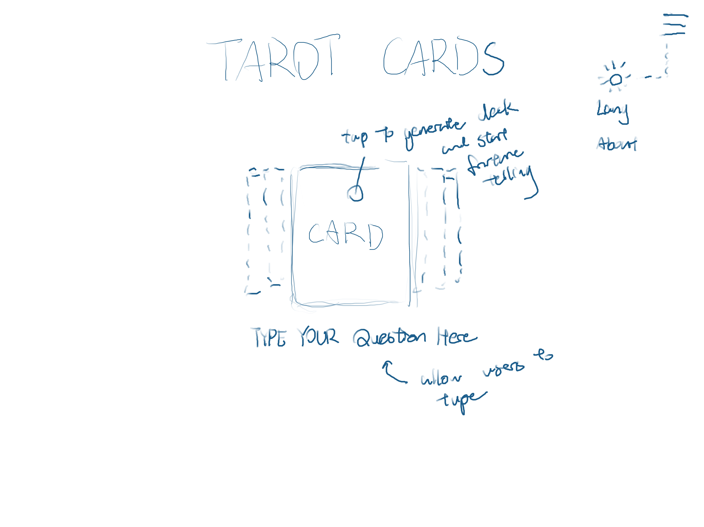

# Final Project Proposal
## Concept: Tarot Card Website
A website that allows you to perform tarot card reading by incorporating AI chat bots

## Inspiration
I tried to search if there is already this kind of website and it turned out there is.
(https://tarotoo.com/). I really like the art style and ux design,but I might do a more simplistic one.

Card game Balatro could also be a good reference with its animation and process of cards.

I wonder if its okay for me to do another tarot card website
since there is already one.

## Skills to use
- animation
- API fetch
- local storage
- random number generation
- text to speech

## Wireframe
