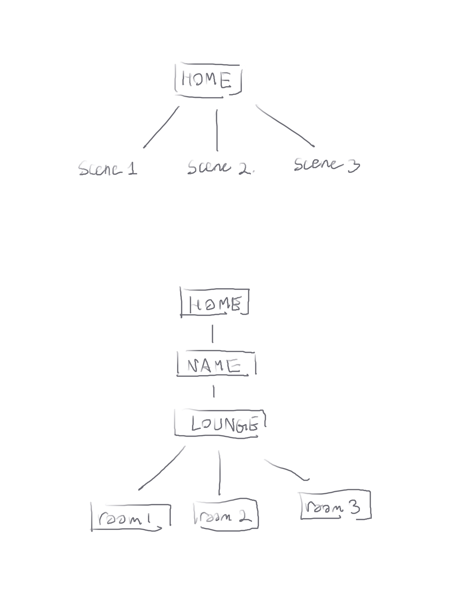

# Midterm Proposal
### Concept
1. Interactve scenes: Scenes with discriptions that are interactive. Users could alter the content of the descriptions and the changes would be reflected by the scene.
2. Chat site: display posts-->how posts/text are displayed
        - drrr.com: clean, fast, and anonymous

### Skills learned
 - websie organization
 - simple styles
 - images
 - links
 - hover

 ### Skills to be learned
 - text input
 - storage
 - more interactions
 
 ### Wireframe

